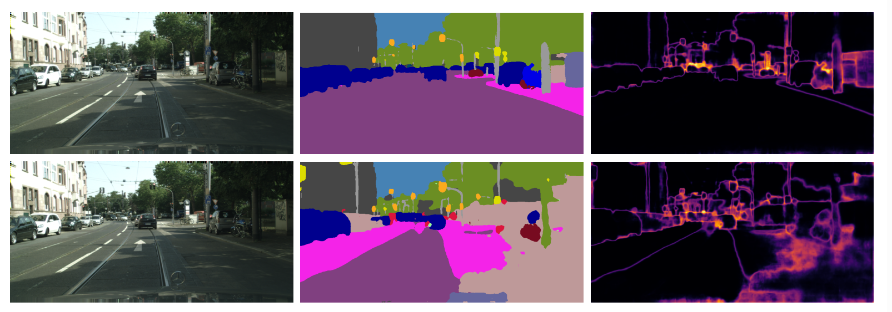
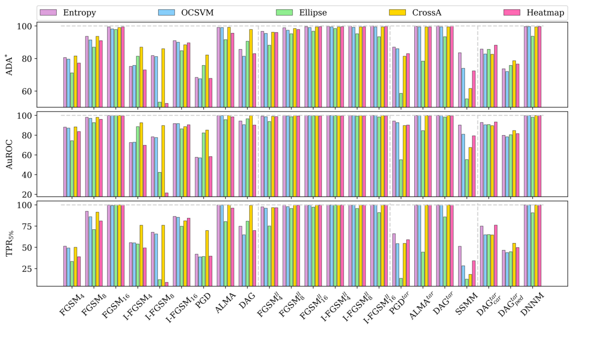

# Uncertainty-Based Detection of Adversarial Attacks in Semantic Segmentation

## Overview

his repository contains the code and experiments accompanying a master’s thesis and scientific publication on adversarial attacks in semantic segmentation.

The work proposes a lightweight detection method based on uncertainty estimation that identifies adversarial inputs without modifying the underlying segmentation model.

The corresponding paper is available on arXiv: https://arxiv.org/abs/2408.10021
---

## Key Idea

Adversarial perturbations affect the confidence of model predictions.

This approach leverages that behavior by:

* computing pixel-wise uncertainty measures (e.g., entropy)
* aggregating them into image-level features
* using these features to distinguish between clean and adversarial inputs

---

## Method Pipeline

```text
Image → Segmentation Model → Uncertainty Map → Detector → Clean / Adversarial
```

---


## Example



Top: clean image  
Bottom: adversarial example  
Left: input  
Middle: segmentation  
Right: entropy heatmap  

---

## Contributions

* Development of an uncertainty-based detection method for semantic segmentation
* Implementation and evaluation of multiple adversarial attacks:

  * FGSM, I-FGSM, PGD
  * DAG, ALMA, DNNM
* Evaluation across different model architectures:

  * Convolutional networks (e.g., DeepLabv3+, PIDNet, DDRNet)
  * Transformer-based models (e.g., SETR, SegFormer)
* Demonstration that:

  * uncertainty is an effective signal for adversarial detection
  * detection works without retraining or modifying models
* Achieved approximately 89% detection accuracy across different attacks and architectures
* Extended analysis to backdoor attacks (training-time poisoning)

---

## Adversarial Attacks

This work evaluates the detection method on a diverse set of adversarial attacks for semantic segmentation.

### Gradient-Based Attacks

* **FGSM** – single-step gradient-based attack
* **I-FGSM** – iterative variant with stronger perturbations
* **PGD** – multi-step attack with projection constraints

### Segmentation-Specific Attacks

* **DAG** – targeted attack optimizing over all pixels
* **ALMA (Proximal Splitting Attack)** – optimization-based attack with minimal perturbations

### Universal Attacks

* **SSMM** – forces predictions toward a fixed target segmentation
* **DNNM** – removes specific classes while preserving others

### Summary

The evaluation covers:

* weak and strong attacks
* targeted and untargeted settings
* image-specific and universal perturbations


---

### Observations

* Iterative and optimization-based attacks (I-FGSM, PGD, ALMA, DAG) are generally stronger than single-step attacks
* Universal attacks enable real-time application but require expensive precomputation
* Segmentation-specific attacks produce more structured and realistic outputs compared to classification-based attacks


## Results

* Consistent detection performance across multiple unseen attack types
* Evaluation performed on the Cityscapes dataset
* Lightweight post-processing approach
* No access to model internals required



Results shown for DeepLabv3+.

Comparison of different detection methods based on uncertainty across multiple adversarial attacks..  
Top: ADA*, Middle: AuROC, Bottom: TPR@5%.

---

## Extension: Backdoor Attack Detection

- Backdoor attacks were implemented as fine-grained poisoning attacks, modifying pixel-level labels during training
### Setup


* Considered both:

  * non-semantic triggers (e.g., artificial line patterns)
  * semantic triggers (e.g., class "rider")
* Targeted class manipulations:

  * cars → street
  * persons → sidewalk
* Training performed on poisoned datasets:

  * 20% trigger injection for non-semantic attacks
  * semantic triggers applied based on class presence

[INSERT FIGURE: Example backdoor trigger + prediction]

---

### Key Findings

* Detection performance is significantly more challenging compared to adversarial attacks
* Entropy-based signals behave less consistently:

  * uncertainty does not always increase under backdoor attacks
  * strong variation across samples
* Learned detectors (e.g., logistic regression, neural networks) show limited generalization
* Simpler methods (e.g., entropy thresholding, OCSVM) are more stable

---

### Insight

Backdoor attacks differ fundamentally from adversarial perturbations:

* Adversarial attacks:

  * directly affect model confidence
  * lead to consistent uncertainty increase

* Backdoor attacks:

  * alter the model during training
  * can produce confident but incorrect predictions

This explains the reduced effectiveness of uncertainty-based detection in this setting.

---

### Conclusion

Uncertainty remains a useful signal, but detecting backdoor attacks requires additional or complementary approaches.

---

## Code Structure (Research-Oriented)

This repository reflects an experimental research workflow.

The code is organized as a collection of scripts used during experimentation:

* attack scripts: generation of adversarial examples
* evaluation scripts: running experiments
* uncertainty modules: computation of entropy and related measures

The structure follows the research process rather than a production-ready pipeline.

---

## Workflow

Typical experimental workflow:

1. Generate adversarial examples
2. Run semantic segmentation models
3. Compute uncertainty maps
4. Extract features
5. Train and evaluate detection models

---

## Technologies

* Python
* PyTorch
* MMSegmentation
* Deep Learning
* Semantic Segmentation
* Adversarial Machine Learning
* Uncertainty Estimation

---

## Publication

Detecting Adversarial Attacks in Semantic Segmentation via Uncertainty Estimation: A Deep Analysis

Authors: Kira Maag, Roman Resner, Asja Fischer
arXiv: https://arxiv.org/abs/2408.10021

---

## Reproducibility Note

This project was developed in a GPU-based research environment.

Due to computational constraints, the repository is provided as-is.
The code corresponds directly to the experiments described in the publication.

---

## Attribution

This repository includes original implementations as well as adapted components from prior research.

In particular, parts of adversarial attack implementations are based on work by Jérôme Rony:

Proximal Splitting Adversarial Attacks for Semantic Segmentation
https://github.com/jeromerony

All adapted components were modified and extended for this work.

---

## Key Insight

Uncertainty behaves differently on adversarial inputs compared to clean data, making it a practical signal for detecting attacks in semantic segmentation systems.
